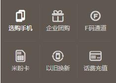
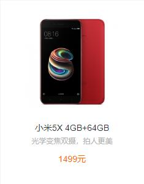
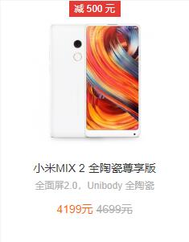
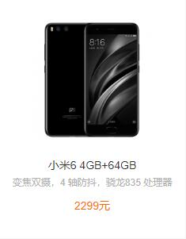
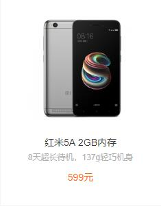

<!DOCTYPE html>
<html lang="en">
<head>
    <meta charset="UTF-8">
    <title>小米官网</title>
    <link rel="stylesheet" href="style.css">
</head>
<body>

    

          

            <ul class="menu">
                <li><a href="">小米商城</a></li>
                <li><a href="">MIUI</a></li>
                <li><a href="">loT</a></li>
                <li><a href="">云服务</a></li>
                <li><a href="">水滴</a></li>
                <li><a href="">金融</a></li>
                <li><a href="">有品</a></li>
                <li><a href="">Select Region</a></li>
            </ul>
          

          

            <ul class="menu2">
                <li><a href="">消息通知</a></li>
                <li><a href="">注册</a></li>
                <li><a href="">登录</a></li>
            </ul>
          

        

            

            

                
购物车中还没有商品，赶紧选购吧!

            

        

    

    

        

        

        

            <ul class="menu3">
                <li><c href="">小米手机</c></li>
                <li><c href="">红米</c></li>
                <li><c href="">电视</c></li>
                <li><c href="">笔记本</c></li>
                <li><c href="">盒子</c></li>
                <li><c href="">新品</c></li>
                <li><c href="">路由器</c></li>
                <li><c href="">智能硬件</c></li>
                <li><c href="">服务</c></li>
                <li><c href="">社区</c></li>
            </ul>
        

    

    

        

           

            <ul class="menu4">
                <li><d href="">手机 电话卡</d></li>
                <li><d href="">电视 盒子</d></li>
                <li><d href="">笔记本</d></li>
                <li><d href="">智能 家电</d></li>
                <li><d href="">健康 家居</d></li>
                <li><d href="">出行 儿童</d></li>
                <li><d href="">路由器 手机配件</d></li>
                <li><d href="">移动电源 插线板</d></li>
                <li><d href="">耳机 音箱</d></li>
                <li><d href="">生活 米兔</d></li>
            </ul>
           

        

    

    

        

            

                
            

            

            
            
            
            

        

    

    

         
       

           手机
       

    

    

        

            

                
            

            
            
            
            
            
            
            
            
        

    

    

    

        
    

    

    

        
    

</body>
</html>
